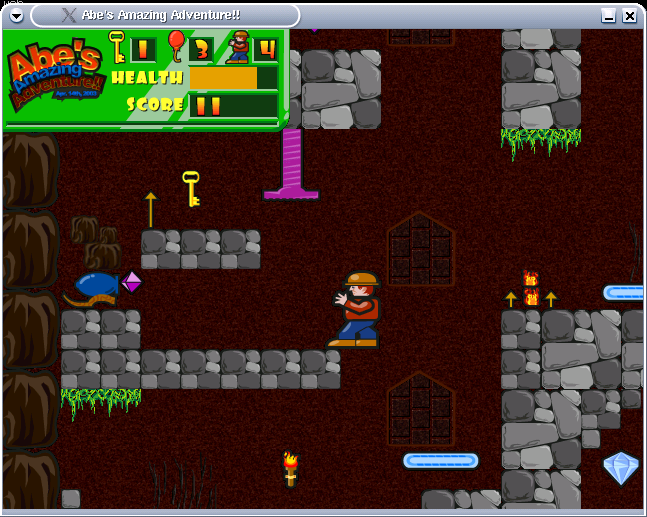

# Abe's Amazing Adventure!!

A platformer built for my son's 2nd birthday (decades ago...)



## How to build it:
You will need the `SDL` and `SDL_mixer` libraries (v1.2) and `scons` to build Abe.

### Mac:
```
brew install sdl sdl_mixer scons
scons --macos
./bin/abe
```

### Linux:
Same as the mac except use the package manager of your choice (yum, apt, etc) to install `sdl_dev` and `sdl_mixer_dev`. 
Run `scons` by itself with no flags.

### Windows:
Since I don't have access to windows, I set up a docker image to cross compile to an .exe via migw. You will need `docker` to run this build.
```
cd docker-build
./make.sh
```
The resulting abe.win.zip file should be the windows executable.

## How to run it:
./abe

and in fullscreen mode:
./abe -f

on Windows:
abe.exe

## Notes:
You can also run: ./abe --help to see some other options.
Abe can in video modes between 320x200 to 800x600. It needs at least a 16bpp mode.
You can do: ./abe -t to see what video modes will run faster in fullscreen mode.

## Controls:
This is only a demo, so please excuse the rough edges. 
On the startup screen, hit "SPACE" to run the game, or "ENTER" to run the editor.
In general the keys are:

### Game:
arrow keys - move
space - jump
enter - use a balloon
esc - quit

### Editor: (to enable the editor set Game.h/GOD_MODE to 1 and re-build)
arrow keys - move
home,end,pageup,pagedown - move around by pages
enter - put down tile
1,2,3 - select layer
del,backspace - clear tile
5,6 - cycle thru tiles
L - load map
S - save map
esc - quit
q,w - make a slide (q-top left, w-bottom right)
q,e - make a rectangle
